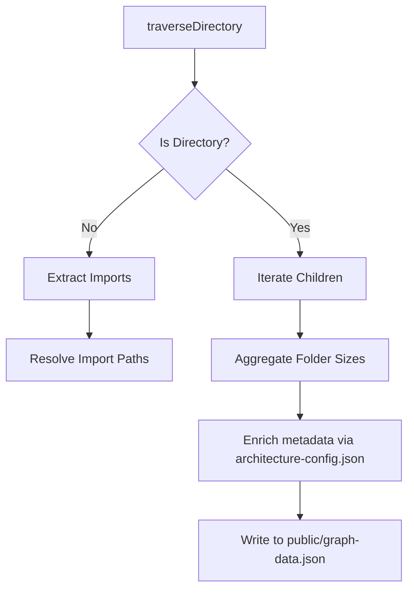

# Architecture & Project Structure

This document details the high-level architecture, directory layout, styling patterns, and configuration mapping of the Samarth main website.

---

## 🏛️ Directory Layout Overview

```
Website-25/
├── .github/                 # GitHub CI/CD workflow pipelines
├── android/                 # Auto-generated Android platform for Capacitor
├── docs/                    # System & developer documentation
├── public/                  # Public static assets & images
│   └── graph-data.json      # Generated 3D graph representation
├── scripts/                 # Custom build and mapping utilities
│   └── generate-3d-map.mjs  # 3D interactive map builder
├── src/                     # Core React codebase
│   ├── assets/              # Simulated database (fake-data), fonts, styles
│   ├── components/          # Reusable react components
│   ├── data/                # Directory for dynamic resources
│   ├── pages/               # Top-level route views
│   ├── scss/                # Centralized SCSS stylesheets
│   ├── App.jsx              # Main App wrapper & route registry
│   └── main.jsx             # React DOM entry point
├── architecture-config.json # Metadata config for project visualization
├── capacitor.config.json    # Capacitor configuration file
└── vite.config.js           # Vite development and builder configurations
```

---

## 🏗️ Core Codebase Structure

### 1. Entry Point & Routing Wrapper
* **[main.jsx](../src/main.jsx)**: Initial entry point that mounts the `<App />` component within the React virtual DOM.
* **[App.jsx](../src/App.jsx)**: Main layout controller. It initializes the **AOS (Animate on Scroll)** system globally, includes persistent layout components (`Header`, `Footer`, `ScrollUp`, `ScrollToTop`, and Vercel `Analytics`), and maps incoming URLs to the respective view components via React Router DOM.

### 2. View Pages (`src/pages/`)
Contains pages rendered at distinct URLs.
* Main routing mapping is defined in **[index.jsx](../src/pages/index.jsx)**, which exports a unified `routes` array mapping paths to components (e.g., `Home`, `Events`, `Gallery`, `Team`, `Study`, `Results`).

### 3. Reusable UI Components (`src/components/`)
Granular and standalone components categorized in subfolders:
* **`header` / `footer`**: Site navigation, responsive layout triggers, and external contact links.
* **`banner`**: Hero layouts with image displays and taglines.
* **`counter`**: Statistic showcases (e.g., resources shared, events hosted).
* **`portfolio` / `project`**: Categorized visual lists.
* **`scroll`**: Scroll detectors like `ScrollToTop` and `ScrollUp` handlers.

---

## 💾 State & Simulated Data Database (`src/assets/fake-data/`)

To avoid server overhead and database query delays, the application stores resource details, notice tables, exam directories, galleries, and team profiles as static JavaScript modules.
* **`dataTeam2.js` / `dataTeam3.js`**: Stores profile information, role details, and social links of student heads, co-heads, developers, and tech team members.
* **`dataStudy/`**:
  * `notes.js`: Links to downloadable lecture PDFs and previous year questions.
  * `playlists.js`: Links to educational playlists on YouTube.
  * `study_channel.js`: Reference links for various online classes and resources.
* **`dataForAspirants/`**:
  * `websites_data.js` & `upcoming-exams_data.js`: References to exam portals, syllabi, and details.

---

## 🎨 SCSS Styling Pattern (`src/scss/`)

The site adopts a structured SCSS architecture to keep styles organized and modular.
* **`abstracts/`**: Contains core variables (`_variables.scss`) for color schemes, spacing, font faces, and helper mixins (`_mixin.scss`) for cross-browser responsive layouts.
* **`component/`**: Styling modules mapped directly to UI structures (e.g., `_button.scss`, `_footer.scss`, `_popup.scss`, `_section.scss`).
* **`_global.scss`**: Root variables, resets, margins, utility classes, and custom scrollbar styles.
* **`app.scss`**: Aggregates all SCSS parts into a single entry point imported in `src/main.jsx`.

---

## 🗺️ 3D Architecture Mapping (`scripts/generate-3d-map.mjs`)

The project uses a custom dependency generator to map and visualize directory and file interactions.



### Configuration: `architecture-config.json`
Provides human-readable descriptions, developer maintainers, and issue trackers for specific files and directories:
* **`folders` section**: Maps descriptions to directories like `src/components`.
* **`files` section**: Highlights implementation difficulty, files requiring attention, or issues (e.g., `"Add error boundary wrapper"` on `src/App.jsx`).
* Run the tool: `pnpm run visualize` creates `public/graph-data.json`.
